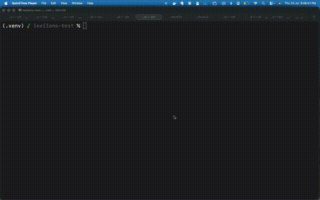
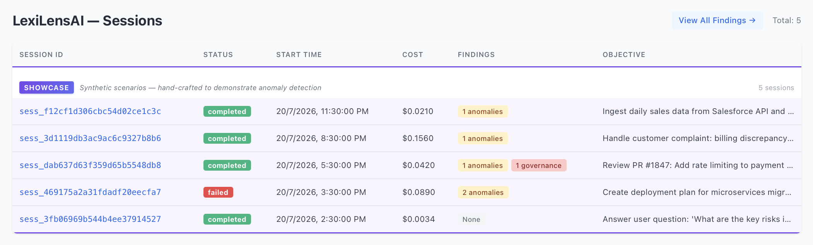
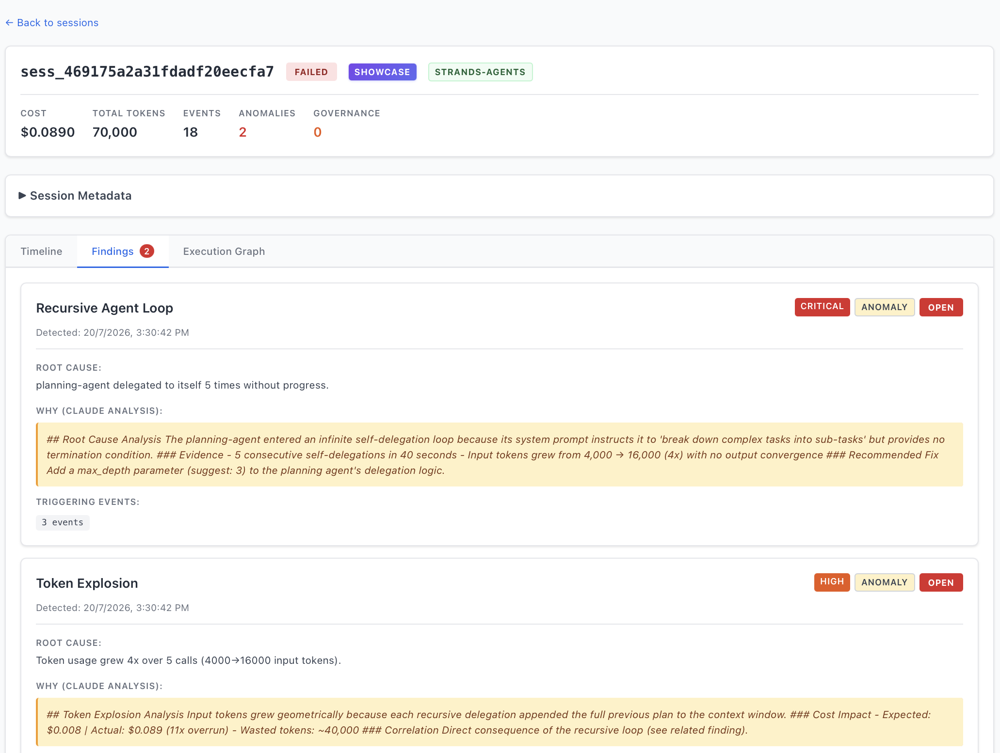
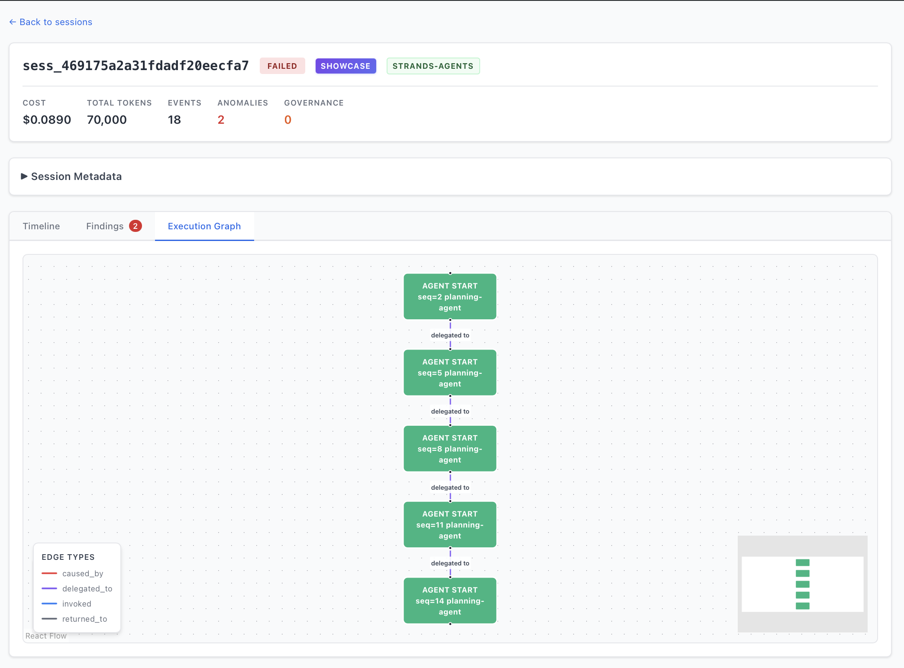
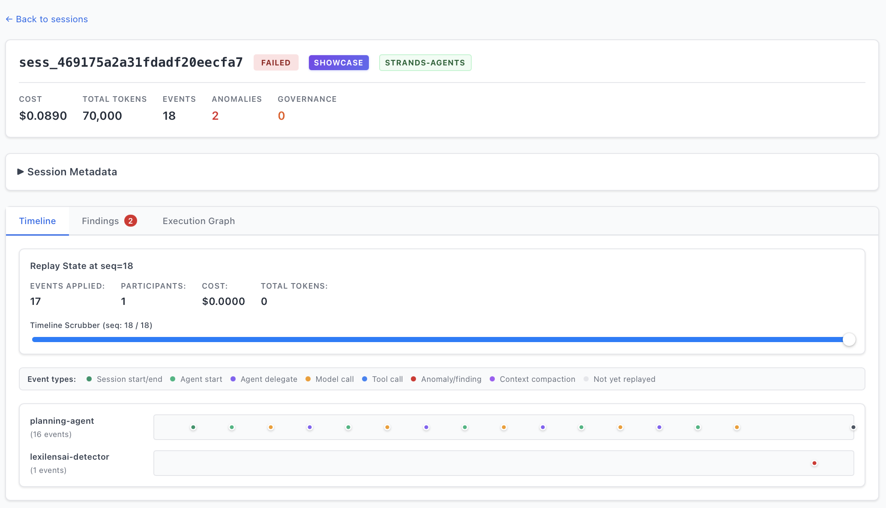

# LexiLensAI SDK

[](https://github.com/curvsort/lexilensai-sdk/actions/workflows/test-sdk.yml)

**See where your Claude tokens go.**

You got a $50 Claude invoice and the Anthropic dashboard shows a total. You need per-call visibility: which calls missed cache, which burned tokens on thinking, which retried silently. That's what this does.

## See it in action



## 30-Second Quickstart

```bash
pip install lexilensai-sdk
```

```python
from lexilensai import LexiLens
import anthropic

lexilens = LexiLens.init(exporter="jsonl")  # ← 1 line added

client = anthropic.Anthropic()  # or AnthropicBedrock() — same SDK, same patch
response = client.messages.create(
    model="claude-sonnet-4-20250514",
    max_tokens=1024,
    messages=[{"role": "user", "content": "Explain prompt caching"}]
)

lexilens.close()
```

```bash
lexilens report
```

```
═══════════════════════════════════════════════════════════
  LexiLensAI — Token Usage Report
═══════════════════════════════════════════════════════════
Session: sess_1784662444 | 1 call | $0.012

  #1  claude-sonnet-4  1,523 in / 847 out / 2,500 cache_create  (1200ms)

Anomalies: none detected
═══════════════════════════════════════════════════════════
```

**That's it.** One import, one init call, zero changes to your Anthropic code. Works with `Anthropic()`, `AnthropicBedrock()`, streaming, and tools.

## Why

- **Per-call token breakdown** — input, output, cache create/read, thinking tokens, latency
- **Cost estimation** — see dollar amounts per call, not just monthly totals
- **Anomaly detection** — flags cache misses after hits, 3x token spikes, thinking overhead >50%
- **Zero config** — `pip install` and add one line. No collector, no infra, no signup

## Detailed Example

```python
from lexilensai import LexiLens
import anthropic

lexilens = LexiLens.init(exporter="jsonl")

client = anthropic.Anthropic()
response = client.messages.create(
    model="claude-sonnet-4-20250514",
    max_tokens=1024,
    messages=[{"role": "user", "content": "Explain prompt caching in one paragraph"}]
)

# Make more calls — each is tracked individually
response2 = client.messages.create(
    model="claude-sonnet-4-20250514",
    max_tokens=1024,
    messages=[{"role": "user", "content": "Now explain extended thinking"}]
)

lexilens.close()
```

```bash
lexilens report
```

```
═══════════════════════════════════════════════════════════
  LexiLensAI — Token Usage Report
═══════════════════════════════════════════════════════════
Session: sess_1784662444 | 2 calls | $0.025

  #1  claude-sonnet-4  1,523 in / 847 out / 2,500 cache_create  (1200ms)
  #2  claude-sonnet-4  1,523 in / 231 out / 2,500 cache_read    (400ms) ← CACHE HIT

Summary:
  Total: 3,046 input / 1,078 output
  Cache efficiency: 50% (1/2 hit)
  Estimated cost: $0.025

Anomalies:
  (none)
═══════════════════════════════════════════════════════════
```

## Features

- **Anthropic SDK instrumentation** — Auto-patches `messages.create()` and `.stream()`. Captures input/output tokens, cache creation/read tokens, thinking tokens, latency, model name.
- **Strands agent instrumentation** — Session-aware spans for multi-agent workflows.
- **Token Usage Report CLI** — `lexilens report` shows per-call breakdown, cache efficiency, thinking overhead, cost estimates, and anomaly detection.
- **Multiple exporters** — OTel collector (gRPC), local JSONL file, or console.
- **Zero config** — Works out of the box. Auto-detects installed frameworks.

## Token Usage Report

```bash
# Default: reads lexilens_spans.jsonl
lexilens report

# JSON output for programmatic use
lexilens report --json

# Specific file
lexilens report -f my_spans.jsonl

# Filter to one session
lexilens report -s sess_1784662444

# Also works as a module
python -m lexilensai
```

The report detects anomalies automatically:

- **Cache miss after hit** — prompt prefix changed between calls
- **Token spike** — 3x+ average suggests retry or context expansion
- **Thinking overhead** — extended thinking consuming >50% of output
- **Errors** — failed calls with error messages

## What Gets Instrumented

### Anthropic SDK (v0.2.0+)

| Metric | Source |
|--------|--------|
| `input_tokens` | Response usage |
| `output_tokens` | Response usage |
| `cache_creation_input_tokens` | Response usage |
| `cache_read_input_tokens` | Response usage |
| `thinking_tokens` | Counted from thinking content blocks |
| `latency_ms` | Wall clock per call |
| `model` | From request kwargs |
| `is_streaming` | create vs stream |

### Strands Agents (v0.1.0+)

| Event | Span Name |
|-------|-----------|
| Session start | `session.start` |
| Session end | `session.end` |
| Agent call start | `agent.start` |
| Agent call end | `agent.end` |

## Configuration

```bash
# Exporter (default: otel)
export LEXILENS_EXPORTER=jsonl    # Options: otel, jsonl, console

# For OTel exporter
export LEXILENS_COLLECTOR_ENDPOINT=http://localhost:4317

# Optional metadata
export LEXILENS_TENANT_ID=acme_corp
export LEXILENS_APPLICATION_ID=my_app
```

Or programmatically:

```python
lexilens = LexiLens.init(
    exporter="jsonl",
    tenant_id="acme_corp",
    application_id="my_app",
    objective="Research task"
)
```

## Exporters

| Exporter | Use Case | Output |
|----------|----------|--------|
| `jsonl` | Development, report CLI | `lexilens_spans.jsonl` |
| `console` | Debugging | Prints to stdout |
| `otel` | Production | gRPC to OTel collector |

## Examples

```bash
# Test installation (no API key needed)
python examples/quickstart_console.py

# Anthropic SDK demo (needs ANTHROPIC_API_KEY)
python examples/anthropic_demo.py

# MCP server instrumentation (needs ANTHROPIC_API_KEY)
python examples/mcp_server_demo.py

# Strands agent demo (needs strands-agents + API key)
python examples/quickstart.py

# Interactive notebook
jupyter notebook examples/production_demo.ipynb
```

See [`examples/`](examples/) for full source.

## Testing

```bash
pip install -e ".[dev]"
pytest tests/ -v
pytest tests/ --cov=lexilensai --cov-report=term-missing
```

## Architecture

```
Your Code (Anthropic SDK / Strands / etc.)
      ↓
LexiLensAI SDK (auto-patches, emits spans)
      ↓
Exporter (JSONL → report CLI, or OTel → collector)
      ↓
lexilens report (local analysis)
  — or —
LexiLensAI Platform (session graphs, anomaly detection, WHY reasoning)
```

## Full Platform

The SDK feeds into the LexiLensAI platform for session-level diagnosis — causal graphs, timeline replay, and Claude-powered root-cause analysis.

| Sessions Overview | Findings (WHY Analysis) |
|:-:|:-:|
|  |  |

| Execution Graph | Timeline Replay |
|:-:|:-:|
|  |  |

**What the platform adds beyond the CLI:**

- Reconstructs full execution sessions from OTel telemetry
- Builds causal graphs showing delegation chains, tool calls, and model invocations
- Detects anomalies (recursive loops, token explosions, cache misses) automatically
- Generates natural-language root-cause explanations via Claude
- Time-travel replay — scrub through any session event by event

[Live demo](https://dxzgv8qrb9ubk.cloudfront.net) — synthetic showcase data, no login required.

## Roadmap

| Version | Status | Features |
|---------|--------|----------|
| v0.1.0 | ✅ Released | Strands agents, OTel/JSONL/Console exporters, session tracking |
| v0.2.1 | ✅ Released | Anthropic SDK instrumentation, token usage report CLI, cost estimation, platform HTTP exporter |
| v0.2.2 | ✅ Current | MCP server instrumentation example (works via Anthropic patching — zero-config) |
| v0.3.0 | Planned | LangChain support, async batching, streaming token capture |

## Contributing

Contributions welcome! Apache 2.0 license.

**Adding a new framework:**
1. Create `src/lexilensai/frameworks/{framework}.py`
2. Implement `patch_{framework}()` and `unpatch_{framework}()`
3. Add tests in `tests/test_frameworks/test_{framework}.py`
4. Update README

## Links

- **PyPI:** https://pypi.org/project/lexilensai-sdk/
- **GitHub:** https://github.com/curvsort/lexilensai-sdk
- **Changelog:** [CHANGELOG.md](CHANGELOG.md)

## License

Apache License 2.0 — see [LICENSE](LICENSE)
